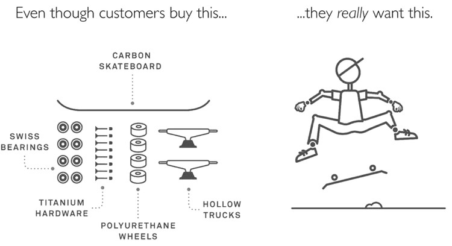

### SPEAKING
Whether you're a conference organizer or a manager, Alan and/or Eric can give a presentation that will inspire, motivate, and educate an audience.
Topics include:
•	How to discover new growth opportunities
•	Minimize the risks and maximize the impact of a new product
•	How to figure out what consumers really want
•	How to get everyone within your company to share the same vision of what progress customers want, and how you're going to make that happen
•	How to create a ResearchOps strategy for defining markets and consumer insights
{width=400px}
*Alan Klement gives a keynote at Innovation Land 2017 (Spanish)*

### JOBS TO BE DONE

## What Is Jobs to be Done?
{width=400px}
*"Upgrade your user, not your product. Don't build better cameras, build better photographers" - Kathy Sierra*

The Quality paradigm has dominated innovation since the mid 80's. The idea is simple: if you improve the quality of your product, then more people will buy it. However, despite advances in this thinking, innovation success continues to elude many.

**Jobs to be Done provides an alternative.** Instead of thinking of market demand in statics, JTBD thinks in dynamics. It's not about objects described as customers needs or desired outcomes, it's about systems and processes that deliver **progress**.
*“A Job to be Done is the process a consumer goes through whenever she aims to transform her existing life-situation into a preferred one, but cannot because there are constraints that stop her.”*
— Alan Klement, from When Coffee and Kale Compete

**Jobs to be Done is about growth.** Creating growth for a product means increasing revenue - usually by acquiring new customers. That means growth comes from persuading consumers to stop buying whatever they're using today, and start buying from you. 

Consumers buy and use products for the first time because they desire some change in their life, and they want to make **progress** towards that change. If they didn't want change, then they'd keep buying the same products over and over again.

When you recognize that you are in the business of delivering progress to consumers, you break free of thinking in terms of static needs and product categories.