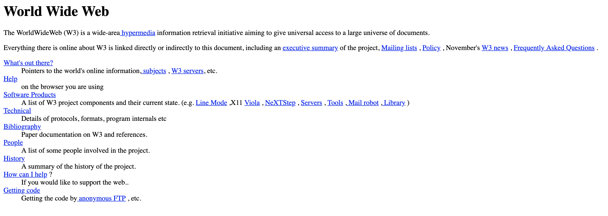

<!-- $theme: gaia -->
<!-- prerender: true -->
<!-- $size: 16:9 -->
<!-- footer: www.MetaBake.org -->

<!-- *template: invert -->

#  [==Metabake==](https://Metabake.org)

#### An open source CLI tool for meta-programming

---
<!--*template:invert -->
# Goal WebApp and Cross Platform *Productivity*
Metabake as a tool aims for high-productivity by leveraging what we have learnt from the past years of Front-End evolution and atemporal main pillars that reside at the foundation of good development practices

In a future with increasing automation. Citizen developers have become more widespread. Nowadays almost everybody can pull out a form or a simple website presence using GUI tools and generators.

Our goal as developers is to be able to both outperform competent citizen developers in speed and while also leaving room for focusing on excellent UI and UX. 
This is possible if we use the increasing automation and trends favouring declarative approaches to our favour

---

<!-- problems to solve: 
	- Losing high paying jobs
	- increasing number of citizen developers
	- pletora of tools / javascript fatigue
	- Present signs of a future -> 2020/230
# Who are competing against developers: citizen developers

---

<!--*template:invert -->
# How to achieve this goal:

---
<!-- *template:gaia -->

# Low code : Generators Markdown…
<!-- move away from serverside/dynamic -->
<!-- show actual code example -->

---

# Keyboard based (not mouse like form tools used by citizen)

---

# Website prototyping and experimenting

--

# UI Focused 

--- 

# Serverless
- Back End/SQL are a liability
        - Escape velocity ??
- FireStore, FaunaDB, etc Serverless

---

# CRUD 

---

# CMS Aware

---

# Cross-platform, AMP Mobile(Cordova/PhoneGap)

---

# Library of Components

# Maintainability and reusability

-- 

# Iterative development

---

<!-- *template: invert -->

# A Bit Of History
<!-- img -->

---
# The first website, was static

#### Browsers were simple document viewers


---

# Waves Of Technological Change

## Websites grows in complexity. 

### What has shaped the last 10 years of web development

- Content-driven 2.0 Dynamic Web
- LAMP / Wordpress
---
<!-- *template: invert -->

# The Current State Of Affairs

---

## The Current State Of Affairs
### JavaScript Fatigue

- In the last years, we've all experienced the _javascript fatigue_ that came pouring out of a storm of frameworks. And, in many cases, there seems to be no clear goal and  often times it leads to _overengineered solutions_ that leave you more exhausted and confused instead of aiding your workflow. it just seems like overengineering without clear direction.

<!-- picture of javascript frontend hell -->

--- 
## The Current State Of Affairs
### Neglecting users that opt for disabling JavaScript.

- There is also the case for users that opt for disabling javascript or have _modest machines_

- As developers sometimes it takes time to realize that not everybody has a blazing fast machine that will deal with poorly engineered and bloated websites.

---

## The Current State Of Affairs
# The understimated DOM

- Also, let's not forget that the web is primary information/document based. That is why the Document Object Model is so important. It shouldn't be treated as secondary or a liability.

---
## The Current State of Affairs
### What about SEO :question:

- Web crawlers currently implement someways for discovering content in either virtual DOM / client side rendered websites.
- The case for SEO

---
## The Current State of Affairs
### Not all is bad: Front-End Cornucopia

- Build tools and compilers -  once a rarity on Front-end - are now part of the normal workflow.
- PHP-based tools and overuse of dynamic approaches are starting to feel bloated an unnecesary in modern Front-end.
- Web Components and AMP are gaining traction.
---

## The Current State of Affairs
### A natural fluctuaction of opposites: 
#### ==**From Client-side back to Server-side**==

|Client-side (Dynamic)| Server-side(Static)|
|:--|--:|
Compiled on the fly | Pre-generated |
Low Resource | Resource-intensive |
Usable offline | Online only |
Secure by default | Needs Security |

---
## The Current State of Affairs
### A natural fluctuaction of opposites
### ==**From LAMP to JAM**==

<!-- explain characteristics of JAM stack -->
- The JAM Stack
https://jamstack.org/

---

## The Current State of Affairs
### Back to Basics: Static Generators

#### Remember the apocalypse of backend:question:
- Many of the constraints that cornered static generated websites and placed upfront dynamically generated sites have fallen away, and will continue to do so. 
- ==**Modular services**== and ==**CDN**== based hosting/deployment  are becoming more pervassive.
- In a mobile era, ==**performance**== is a must: Loading speed of Static Generated Sites is unparalleled.

---
## The Current State of Affairs
### Git vs Mount
- Writing directly in Markdown and working with Git it's a default workflow for developers. But it's not so for average consumers who may find it discouraging .
- There is still a current Gap on how to bring together an easy-to-use for consumers CMS and static website generation.
- Workflows based on mounting Webdav could solve the problem for huge content management systems that are used by average citizens and not developers.
<!-- explain advantages of mount -->

---

## The Current State of Affairs
### We have not seen a productivity jump in ~10 years.
<!--- refer back to waves of tech change --->
<!-- show 1GL/2GL/3GL/4GL changes -->

---
<!-- *template: invert -->

# A Glimpse Into The Future


---
## A Glimpse Into The Future

### The apocalypse of Backend

- ==**CDN**== is cheaper and faster
- However, CDN is problematic with dynamic sites due to notorious cache invalidation
- A breeze to use with Static Generators

<!-- pic of CDN usage -->

--- 
## A Glimpse Into The Future

### The apocalypse of Backend

- Serverless
- AWS, FireStore FaunaDB, and more
- Hosted REST SaaS
- Deliver for both mobile and web from a single pure API

---
## A Glimpse Into The Future
### Every web app is a mobile app and every mobile app is a web app
<!-- explain about PWA guidelines-->
- People are savyy regarding their mobile device storage
- If a PWA offers same experience as an instalable app the user will probably prefer the PWA

---
## A Glimpse Into The Future
### What will shape Front-End from 2019-2020
- Server-less
- CDN
- Static Generators 
- Mount

---
## A Glimpse Into The Future
### What will shape Front-End from 2019-2020

- Markdown
- Code the prototype
- Increasing Automation
- Digital transformation & rise of citizen developers
---

<!--- template: invert --->
#  Closing the Gap between Past, Present and Future of Web Development:
## MetaBake
<!-- img -->

---
# Why MetaBake
### Simple starter requirements:

- HTML 
- CSS
- JavaScript
- Yep, that's it. Nothing more.
---

# Metabake 
### ==Based on:==
- Automatic and Declarative Programming
- Static Generation
- Templating Markup
- Reusable Web Components 
- Dynamic Data Binding
- Iterative and Fast Development 
---

# MetaBake
### ==It allows you to:==
- Gradually Adopt it
- Leverage a single codebase and SasS as the Only architecture
- You can onboard easily all kinds of developers. From citizen developers to junior and senior developers.
- CMS-aware Static Websites and simple custom CMS

---
# MetaBake
### ==Aims for:==
- SEO and Competitive Content Marketing
-  AMP
-  CMS
- UI First

---
# MetaBake

### What makes MetaBake different from other SSG like Gatsby ?
---

# MetaBake

### What makes MetaBake different from other JS Frameworks like React / Angular?

- There is almost no learning curve. JavaScript, HTML and CSS is all you need to start using it.
- Also, if you are already familiar with Sass/scss and markup generators. You will ace it.
- We have a clear aim for high productivity

---

# MetaBake

## Web Components. 

### Importance of them

### Advantages

---

# MetaBake
 
# How does Web Components relate to 4GL / Declarative ?

---
# Focus on UI Design

*"Design is a Form of Authority."*

## Use to your advantage the increasing automation in development.

- Leverage CSS Preprocessors
- Build upon existing CSS Frameworks

---
# Focus on UI Design

## ==Creativity== cannot be automated.
- Consider Design a key target, not a disposable.
<!---img of design// hierarchy of needs in design--->

---

# Practical Example

<!--- td --->
<!--- perhaps include a video here on how a the CMS + CMS works ? -->

----
# Get Started 

```javascript
$ yarn global add mbake
$ mbake -w .
$ cd website
$ mbakeX -w .
```
#### :arrow_right:  https://MetaBake.org/
<!--- place logo --->

---

# Thank you!

#### https://MetaBake.org

<small> Slides written with Marp</small>

---
