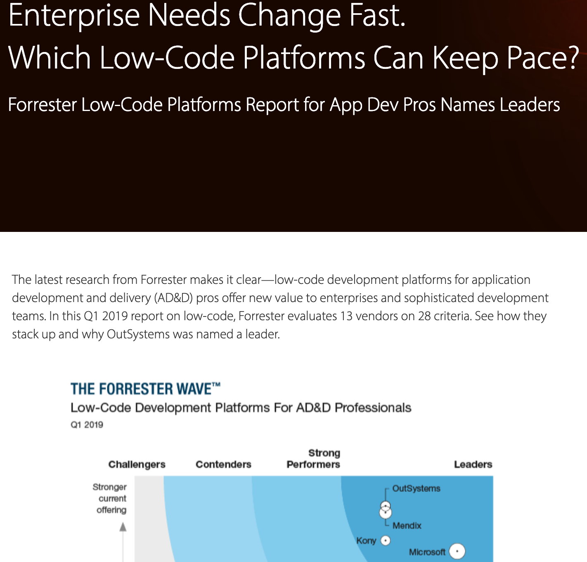

<!-- $theme: default -->
<!-- prerender: true -->
<!-- paginate: true -->
<!-- page_number: true -->
<!-- $size: 16:9 
<!-- footer: www.Metabake.org -->

## "Second largest computer company? DEC"

Now gone.

---

## Vic Cekvenich
- CTO, Vendio (largest eBay partner); sold to Alibaba
- Very first book on Struts MVC ~ 2 years ahead of 1.6mm developers

|||
|:-:|:-:|

---

# Agenda
- Part I: low-code status
- Part II: ( a problem for IT staff) and my productivity solution ( 10 pillars of Metabake.org )
- Demo of automatic programming

---

## Automation

---

<!---

- Can someone read the middle # of software engineer salary above?

--->

---

## Software Apocalypse (read article later)
|||
|:-:|:-:|

---

## Waterfall process 

---

## Backbone, Ember, Knockout, etc. 

--- 
### Just a tate of .js Frameworks
|||
|:-:|:-:|

---

## Lack of added value

---

## Survey says: Change of directions

---

## Examples:
|||
|:-:|:-:|

---

### Linus (creator of Linux) on developers getting lost:
"Even if the choice of C were to do *nothing 
but keep the C++ programmers out*, 
 that itself is a huge reason to use C."
- Me: Damaged goods

---

## Or Airtable

--- 

# Part we - low-code status before the winter of 2020:
- 90% of developers will lose their job. eg: Is there a job where you develop a spreadsheet: but first someone has to tell you what kind of spreadsheet. 
- Citizen developers: No need to know loop, hashing, normalization, failover, timeout, bla, bla. 
- low-code is 10X cheaper and 10x quicker.
- Cuts: first expensive developers, or working on complex tech.
- EG: From Data Center to Cloud we had **90% budget cuts**. Or Mainframes, Minis. 
**Black swan**, if you graduated after 2003, you did not see this kind of a wave.

--- 

## Signs of shift: 
|||
|:-:|:-:|
I provide a list of low-code in the 'Pillars' document.

---

# Part II: What movie has line: 
##  'You're already dead. Everybody dies, you know we believe it' 

First time it happened, we did nothing.

### Here is what I'll do to be in 10% of IT survivors: "my team and me will code quicker than citizen developers". 
