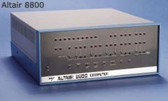
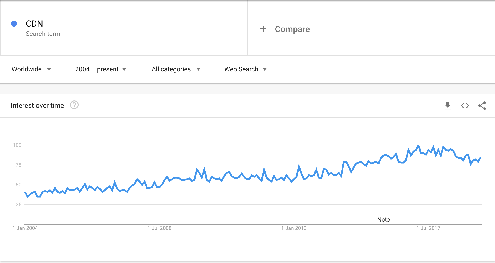
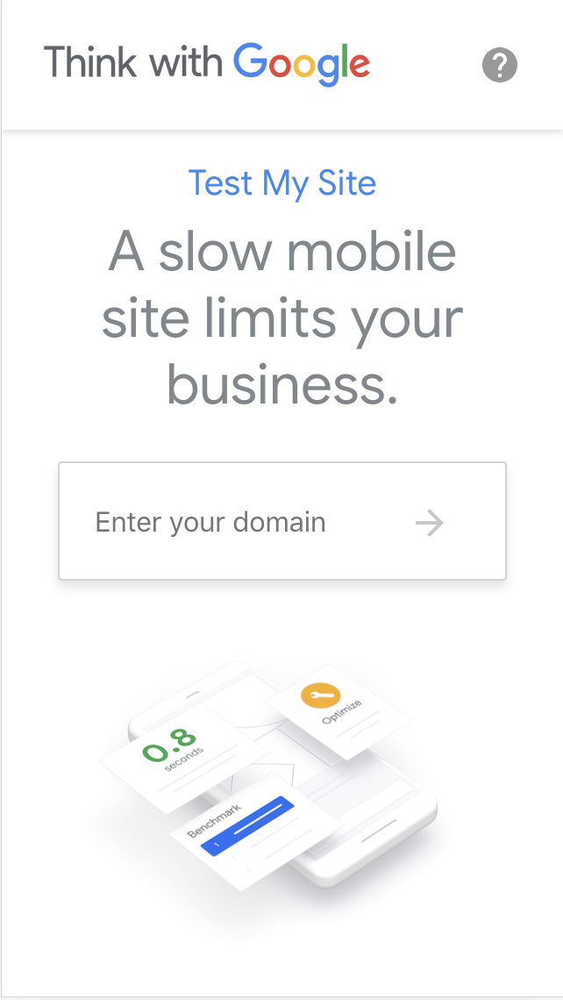

<!-- $theme: gaia -->
<!-- prerender: true -->
<!-- $size: 16:9 -->
<!-- footer: www.MetaBake.org -->

<!-- *template: invert -->

#  [==MetaBake==](https://Metabake.org)
<!-- logo -->
## We partner with you to build now the future of software.

---
<!-- *template: invert -->
## Faster, cheaper and without sacrifying quality
#### Is it possible?

--- 
#### Faster and Cheaper Software Development

- It is thought traditionally that between Fast, Cheap and Good you can only have 2 and need to sacrifice the other. 

- So, if you want a high quality app developed in a very short amount of time, it will be expensive. Same as if you want it fast and cheap, then it would be at the cost of questionable quality.

---
<!-- *template: invert -->
# But, is this always the case?

---

### Think About The Evolution Of Computer Science:
   

---
#### Evolution Of Computers
- Back in the days, a computer was so big and expensive and it took so many people to program it that they were considered a rarity confined to experimental laboratories. 

---
#### Evolution Of Computers
- Yet little by little and with every next wave of innovation computers became the smaller, faster, cheaper and more resilient ubicous devices that shape every corner of human technology nowadays.

---
<!--*template:invert -->
# So yes, to build quality software faster and cheaper is possible.
---

## If you do it in sync with a new wave of ==**Disruptive Technological Innovation**==.

---

#### Waves of Disruptive Technological Innovation

<!-- show 1GL / 2GL / 3 GL / 4 GL -->

- Every 10 years approximately there has been some kind of tipping point in computer science that allowed dramatic increases in development speed and disruptive cost cuts.

> <small>_The growth pattern of digital disruption shows why it seems so much sudden than it is. For several years, the market share of the new business models builds slowly. During that time, the old model also grows, albeit more slowly. Suddenly, the system reaches a tipping point. Market share quickly shifts from the old model to the new, and the incumbent companies bound to the old model can no longer operate as profitably._</small> --Source: PwC and Strategy&

--- 
### Waves of Disruptive Technological Innovation

. We are reaching again a ==**new tipping point**==. 

#### And here at MetaBake we proudly consider us early adopters of the technology stacks that will shape the future of software development. 

---
<!--*template: invert -->
# How ?
---

## Our approach
- We leverage the increasing automation and low-code/high-productivity tools to help us develop faster and with less error-prone approaches
- This leads naturally to cheaper development costs as we are able to compress the time it takes from building a prototype and launching a final product. All without impacting negatively the quality.

---

## Iterative Prototyping
- We believe in iterative development and continuous improvement. 

---
## Flash Agile
- In a true Agile flavour, our tools allows us to reuse and build the next step of development upon a previous one.

---

# Scalability 
- We follow a Front-End first approach
<!--related to front-end first -->

---

# Better performance
<!--Related to FRont-end first:
- Backend made to fit the final data needed for the app the user will be interacting with
- Not the other way around: Result a high performant and well optimized backend with the best suite structure
 -->
 ---
 
### We are continously building and improving a library of highly-reusable intelligent components in the style of AMP.

---

## Explain AMP approach

---

## This allows us to extend the usability life of a codebase with well tested and solid approaches.

---

# Front-End First

### Why Front-End first
- Front-End is currently undergoing an accelerated evolution: Front-End tech stacks become outdated easily
- Meanwhile, Back-end structures suffer less change than Front-End Stacks
##### Therefore, it's imperative to build first a solid, scalable and performant Front-End
---

# Front-End First
### Advantages

#### Deliverable early prototypes
- We are able to hand <!--- is this phrasal verb correct? --> working prototypes to costumers to interact with and gather better feedback for future development iterations
#### Costumer-centric approach
- We first make sure that we understand the client requirementes and deliver an efficient UI and UX that suits the needs
---

# Front-End First

### Advantages

#### Better performance
- We develop the data structure and services needed as a _serverless_ back-end fully optimized and made to fit the final data required by the app/web-app or website. 
- We don't build unnecesary payloads or overengineered and monolithic backend structures.
---

### Advantages

#### Ability to focus on state of the art UI

- Design as a form of authority. Decisions are often times made unconsciously and/or emotionally.

--- 
### Advantages
#### Ability to focus on state of the art UI
- A solid and aesthetically pleasing design generates trust, increases conversion rates and reduces _customer anxiety_
<!-- fletcher method?-->

--- 

# Serverless
<!-- image of serverless // cloud -->

---

# Serverless
#### Advantages:

 - Fast integration
 - Lower maintenace costs. 
	- 90%+ of cost in software development is maintenance.
 - Increased data resilience
 - Unparalleled security
 
---

<!--*template: invert -->
# What we can build together

---
<!-- *template: gaia -->

# Custom Mobile Apps and WebApps
<!--Talk about hybrid approach -->

---
<!-- *template: gaia -->

# Light or Commercial CMS

---
## Light or Commercial CMS
<!-- No more wp headaches -->
#### Custom user-friendly Content Management Systems that bring:
-  Higher efficiency
-  Easy SEO

---
<!-- *template: gaia -->

# E-commerce

---

## E-commerce
<!-- A custom CMS allows to develop E-commerce  -->
- We build unique and fast E-commerce sites based on custom CMS
- Easy to manage and secure
- Leveraging our static generator with CDN deployment for a blazing user experience

---

<!-- *template: gaia -->

# Websites

---
## Websites

- High Quality Design with mobile-first approach
- Material design best practices

<!--
 - high quality design website with mobile-first approach
 - Material design best practices
 - Component based approach makes possible faster loading speed and lowers user bounce rate
 -->

---
<!-- *template: gaia -->

# SEO
---
## SEO
- Our tech stack is highly ==SEO-friendly==
<!--Show example of front matter .yalm vs raw html headers ?
 - Client Side Rendered Apps are penalized by crawlers ? 
-->

---
<!-- *template: gaia -->
# Intelligent Web Components

---

## Intelligent Web Components
#### The future of the Web
<!-- this is related to AMP -->
<!-- introduce some of the AMP approaches and how our components align with this principles -->

---
## Intelligent Web Components

==**Advantages:**==
- User First Approach
- High Reusability
- Building websites based on components is faster, easier and less error-prone
- Improved load time and higher conversion rates

---
<!-- *template: gaia -->

# Hosting Support

---
## Hosting Support

#### Content Delivery Network (CDN)

- We provide services for setting up and maintaing CDN based hosting. 

---

## Hosting Support
#### Content Delivery Network (CDN)
- CDN was once a rarity reserved for big tech corporations like Facebook or Google.

---
## Hosting Support 
#### Content Delivery Network (CDN)
 ==**Advantages:**==
Nowadays CDN are very cost-effective and ubicuous. This makes possible to deliver to users _on the edge_ lowering greatly the waiting time, which is one of the main reasons for a _high bouncing rate_

<!-- -->

---

<!-- show picture relating high bouncing rate and loading speed of web/app -->
- CDN also allows for easy and quick scalability, better performance, decreased maintenance costs, instant deployment and updates.
---
