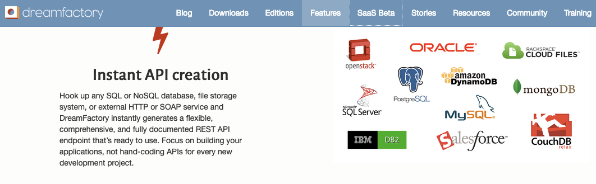

<!-- $theme: default -->
<!-- prerender: true -->
<!-- page_number: true -->
<!-- $size: 16:9 -->
<!-- footer: mBake.org -->
## HW costs are down; but also development costs need to go down

---

## Software development costs as well

---

## Primates use a box to reach

---

### Pillar 1: Digital transformation, change management, and apocalypse of Cloud v1.0

---

###  The costs are not what you think they are.

---

###  The costs are not what you think they are.

---

### CDN is cheaper and faster; so is Text Search 
|||
|:-:|:-:|

---

### AWS, FireStore, and more
|||
|:-:|:-:|

---

###  Hosted REST SaaS 

---

###  Don't shoot at the target
## Lead it. 

---

### Pillar 1: Digital transformation, change management, and apocalypse of Cloud v1.0
- Leverage SasS services as the only architecture
- Leverage Web/HTML throughout org
- Leverage low code by citizen developers

---

## Pillar 2: Learn Quickly; including computer-augmented/generators
|||
|:-:|:-:|

---

### Learn the most popular templating language. Quickly.

---

### Pillar 3: SEO, Competitive Content marketing, AMP

---

## Pillar 4: Year 2019 tech: Generator, Code Prototype, Mount, Markdown, Components

---

