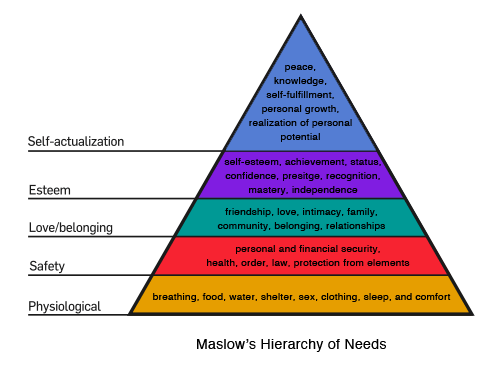

<!-- $theme: gaia -->
<!-- prerender: true -->
<!-- $size: 16:9 -->
<!-- footer: www.MetaBake.net -->

<!-- *template: invert -->

#  [==MetaBake==](https://INTUITION.DEV)
<!-- logo -->
## We partner with you to build now the future of software.

---
<!-- *template: invert -->
## Faster, cheaper and without sacrificing quality
### ==**Is it possible?**==

--- 
#### Faster and Cheaper Software Development

- It is thought traditionally that between Fast, Cheap and Good you can only have 2 and need to sacrifice the other. 

- So, if you want a high quality app developed in a very short amount of time, it will be expensive. Same as if you want it fast and cheap, then it would be at the cost of questionable quality.

---
<!-- *template: invert -->
# But, is this always the case?

---

### Think About The Evolution Of Computer Science:
   

---
### Evolution Of Computers
- Yet little by little and with every wave of innovation computers became the smaller, quicker, cheaper and more resilient ubicous devices that shape every corner of human technology nowadays.

---
### Evolution Of Computers
- So **yes**, to build with quality, quicker and cheaper **is possible**. If you do it in sync with a new wave of ==**Disruptive Technological Innovation**==.

---
<!--*template: invert -->
# Waves of Disruptive Technological Innovation
---
### Waves of Disruptive Technological Innovation

> <small>_The growth pattern of digital disruption shows why it seems so much sudden than it is. For several years, the market share of the new business models builds slowly. During that time, the old model also grows, albeit more slowly. Suddenly, the system reaches a tipping point. Market share quickly shifts from the old model to the new, and the incumbent companies bound to the old model can no longer operate as profitably._ </small>

<small>
Source: PwC and Strategy& 
</small>

--- 
### Waves of Disruptive Technological Innovation

- Therefore, every 10 years approximately there has been some kind of tipping point in computer science that allowed dramatic increases in development speed and disruptive cost cuts.

- We are currently reaching again a ==**new tipping point**==. 

- And at **MetaBake** we proudly leverage the technology stacks that will shape the future of software development. 

---
<!--*template: invert -->
# How will it be the future of software?
## Our Approach

---
### Our Approach
- We leverage the ==**increasing automation**== and low-code/high-productivity tools to help us develop quicker and with less error-prone processes.

- This leads naturally to cheaper development costs as we are able to compress the time it takes from building a prototype and launching a final product. All ==**without impacting negatively the quality**==.

---
<!--*template:gaia -->
# Pillars Of Our Approach:
## Iterative Prototyping
---

### Iterative Prototyping
- We believe in iterative development and continuous delivery. 
- In a true _Agile_ flavour, our tools allows us to reuse and build the next step of development upon a previous one. 

---
<!--*template:gaia -->
# Pillars Of Our Approach:
## Agile & Flash Teams

---

### Agile Flash Teams

- We leverage a worldwide and increasingly remote work culture of software development.
- We favour rapid iterations and asynchronous work. Leading to greatly decreased sprint times with timescales of hours instead of days.

---

<!--*template:gaia -->
# Pillars Of Our Approach:
## Intelligent Custom Elements

---

### Intelligent Custom Elements

- We are continously building and improving a library of ==**highly-reusable intelligent components**==.These components are compliant with Accelerated Mobile Pages standards and are becoming increasingly pervassive.

- A component based development allows us to **decrease costs by extending the usability** life of a codebase with well tested and solid approaches.
 
---
<!--*template:gaia -->

# Pillars Of Our Approach:
## Front-End First
---

### Front-End First

#### ==**Why**==
- Front-End is currently undergoing an accelerated evolution: Front-End tech stacks become outdated easily with new frameworks and patterns appearing almost each week/month.

<!-- pic related to javascript fatigue// rapid evolution of front-end vs stagnation of back-end -->

- Meanwhile, Back-end structures suffer less change than Front-End Stacks.
- Therefore, it's imperative to build first a ==**solid, scalable and performant Front-End**==.
---

### Front-End First
#### ==**Advantages**==

##### Deliverable early prototypes
- We are able to hand <!--- is this phrasal verb correct? --> working prototypes to costumers to interact with and gather better feedback for future development iterations.
##### Costumer-centric approach
- We first make sure that we understand the client requirements and deliver an efficient UI and UX that suits the needs.

---

### Front-End First
#### ==**Advantages**==

##### Better performance
- We develop the data structure and services needed as a ==**Serverless Back-End**== fully optimized and made to fit the final data required by the app/Web App or website. 
- We don't build unnecesary payloads or overengineered and monolithic Back-End structures.
---

### Front-End First
#### ==**Advantages**==

##### Ability to focus on state of the art UI

- Design as a form of authority. 
- Decisions are often times made unconsciously and/or emotionally.

--- 
### Front-End First
#### ==**Advantages**==
#### Ability to focus on state of the art UI
- A solid and aesthetically pleasing design generates trust, increases conversion rates and reduces _customer anxiety_.
 
 

---
<!--*template:gaia -->
# Pillars Of Our Approach:
## Serverless Architecture

---

### Serverless Architecture

- A scalable and dynamically managed infrastructure for back-end needs based on _Microservices_ and _Function As A Service_.
<!-- explain in two sentences serverless -->

---

### Serverless Architecture
#### ==**Advantages**==

 - Fast integration.
 - Lower maintenace costs. 
 	- more than 90% of the cost in software development is related to maintenance. 
 - Increased data resilience.
 - Unparalleled security.
 
---

<!--*template:invert-->
## Our Approach

<!--the underpinning tools of our development approaches enable us to offer -->

- Quick and Easy ==**Scalability**==.
- Blazing ==**Performance**==.
- ==**Cost-effective**== Development.
- ==**Low**== Maintenance.

---

<!--*template: invert -->
# What we can build together

---
<!-- *template: gaia -->

# Custom Mobile Apps and Web Apps

---

### Custom Mobile Apps and Web Apps

>_Write once, run anywhere_
 
- We leverage unified codebases in Web and Mobile apps for bringing together quicker development and reduced maintenance costs. While also ==**combining the best**== of both worlds.

- This allows us to offer a ==**tailored unified experience**== and **platform-agnostic** experience for all end-users. 

- Also, it makes ==**a breeze to deploy**== and update the app in all the target platforms instantly.

 <!-- show tendency of unified codebases for mobile and Web Apps -->

---
<!-- *template: gaia -->

# Light and Commercial Content Management Systems

---
### Light and Commercial CMS

##### Say goodbye to bloated and security-flawed CMS:
- We offer you a ==**custom, user-friendly, light, and fully-fledged commercial CMS**== to take full control of your content.

##### Say hello to:

-  Higher ==**efficiency**==, ==**security**== by default and  ==**easy SEO**==.

- You will have also the possibility to ==**customize styling**== for your content pages without compromising the stability and security of your website.

---
<!-- *template: gaia -->

# E-commerce

---

## E-commerce
- Built on top of a custom commercial CMS.

<!-- e-commerce related pic -->

- Create ==**unique, easy to manage, secure and fast E-commerce**== sites that fully leverage state of the art web development with CDN hosting for a blazing user experience.
---

<!-- *template: gaia -->

# Websites

---
## Websites

- High Quality Design with mobile-first approach.
- Express your branding through **beautiful and solid UI**.
- Remember, our tech stack is ==**highly SEO-friendly**==.
- Furthermore, our **Custom Elementsonent based** approach makes possible quicker loading speeds and an integrated mobile experience that lowers user bounce rate.

---
<!-- *template: gaia -->
# Intelligent Custom Elements

---

### Intelligent Custom Elements
- Wether you want to create from scratch a new site/app or update an existing one, we got you covered with reusable, solid and well-tested Custom Elements.

- Our Custom Elements adopt the best practices for *Accelerated Mobile Pages*, also known as **AMP**. 
---
### Intelligent Custom Elements

#### The future of the Web
- The **AMP** standard is increasingly being  adopted by major companies and startups alike. Since one of its mains targets is to produce **seamless interfaces** where user experience and ad monetization don't collide, but **intertwine**.
 
<!--another pic -->

---

### Intelligent Custom Elements

==**Advantages:**==
- **User First** Approach.
- High **Reusability**.
- Building websites based on components is **quicker**, easier and less error-prone.
- **Improved load time** and higher conversion rates.
- Increased **Maintainability**.
- **Cost-effective**.
---
<!-- *template: gaia -->

# Hosting Support

---
### Hosting Support

#### Content Delivery Network (CDN)

- We provide services for setting up and maintaing CDN based hosting, as our tech-stack aligns perfectly with the requirements for a seamless CDN integration.
- CDN are networks of servers and data centers spread geographically. This ensures ==**high content avaliability and performance**== across all the globe.

---

### Hosting Support
#### Content Delivery Network (CDN)
- CDN was once a rarity reserved for big tech corporations like Facebook or Google.

- Nowadays CDN are very **cost-effective and ubicuous**. This makes possible to deliver to end-users _on the edge_ lowering greatly the waiting time, which is one of the main reasons for a _high bouncing rate_.

- CDN also allows for easy and **quick scalability**, better performance, decreased maintenance costs, **instant deployment** and updates.

---
<!-- wrap up -->
### Software development is thriving on the verge of a major disruptive change and we want you to join us at the top of the tipping point
<!---*template: invert-->
### www.MetaBake.net
# Thank you

