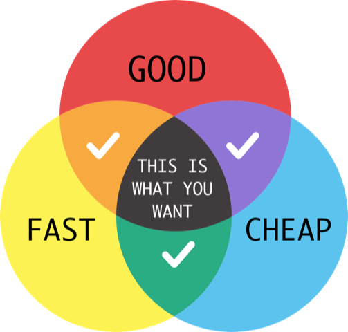

<!-- $theme: gaia -->
<!-- prerender: false -->
<!-- footer: www.INTUITION.DEV -->
<!-- *template: invert -->
#  ==INTUITION.DEV==

#### INTUITION.DEV is the futuristic open source bundler/builder for pro developers with 10-fold productivity via automation, low-code, cross-platform, static-generator, and a built-in WebAdmin editor, facilitating app maintenance by end-users.

---
<!-- page_number: true -->

###  Low-code?

What will the future of professional development look like?
#### We developers will likely use automation and a low-code generator.

---

## Iterations?!

Version 1.0 spec is followed by next version - majority of effort is after 1.0 release!
#### - What if end-users could maintain and build next version?
#### - INTUITION.DEV is built in Pug language

---

<!-- *template: invert -->
#  ==INTUITION.DEV==

#### INTUITION.DEV is the futuristic open source bundler/builder for pro developers with 10-fold productivity via automation, low-code, cross-platform, static-generator, and a built-in WebAdmin editor, facilitating app maintenance by end-users.

---

Demos(/agenda):
### 1. Foundation
### 2. SEO Demo (A 3 step plan)
### 3. CRUD Demo
### 4. Advanced 

---

Foundation:

## - Sass / BootStrap default
## - Written in: ==Pug==
## - Static Generation
### - CDN (Cheaper, Faster)

==DEMO== Foundation (mbake CLI, css, pug, start)

---
3-step-plan:
## #1. Build something
## #2. Market it
## #3. Profit!

#### We'll skip step 1, the app for one moment.
#### Step 2: SEO first. Then we'll go back to step 1 - build an app.

---
<!-- *template: invert -->
Step #2 - SEO:
#### - Customers coming in
#### - We need SEO!
### No matter what app we build, you need SEO. Static is not optional

==DEMO== SEO (custom server API in javascript - same as CLI, user auth built in, WebAdmin, clone a new static page, SEO)

--- 

SEO

---

Promised step #1: App!

==DEMO== CRUD ( ViewModel, Validation, SQL)
Scrape: ( http://pug.metabake.net )

---
<!-- *template: invert -->
Promised step #1: App.

### Web app? Mobile app!!

# OK! Same code base:

==DEMO== advanced/Mobile 2 steps ( Web App, Electron, Cordova, Android, Components )

---

# *Web App and Mobile App is same code base.*

---

Features of INTUITION.DEV:
- Standards Based / Pug
- Open Source
- SEO
- CRUD | ViewModel
- built in user auth
- FTS and SQL
- keyboard driven (F12 Custom Elements in v1.1)
- cross platform / mobile from single code base

---

Almost THE END, FAQ:
#### What about .js frameworks (React / Vue, Flutter/Ionic, goHugo/Jekyll, WP/ Shopify)? 
#### - Ans: We compare to low-code, not (.js) frameworks. 

---

<!-- *template: invert -->
#### INTUITION.DEV alternatives, low-code, but targeting citizen developers: 
- Coda_io
- Wix Corvid
- Airtable
- Bubble
- iCodeBetter
- MS PowerApps
- Oracle Visual Builder

---
Low Code

---

How to get Started:

### Full docs are online in github, and at www.INTUITION.DEV
### For example: `npm i -g intu`

--- 

Train the trainer: 
- SEO
- CRUD | ViewModel
- built in user auth
- FTS and SQL
- keyboard driven (F12 Custom Elements in v1.1)
- cross platform / mobile from single code base
- Lazy loading

---

Did you miss anything shown? 
#### - Start: Scrape to Pug
#### - SEO and 3 Steps (Discovery)
#### - CRUD (w/ ViewModel and APIs)
#### - Cordova / Native is same code base
#### - Maintenance iterations reduce cost
---

#### Please star our main project here:
- https://github.com/INTUITION-dev/INTU
---

<!-- *template: invert -->
#  ==INTUITION.DEV==

#### INTUITION.DEV is the futuristic open source bundler/builder for pro developers with 10-fold productivity via automation, low-code, cross-platform, static-generator, and a built-in WebAdmin editor, facilitating app maintenance by end-users.

